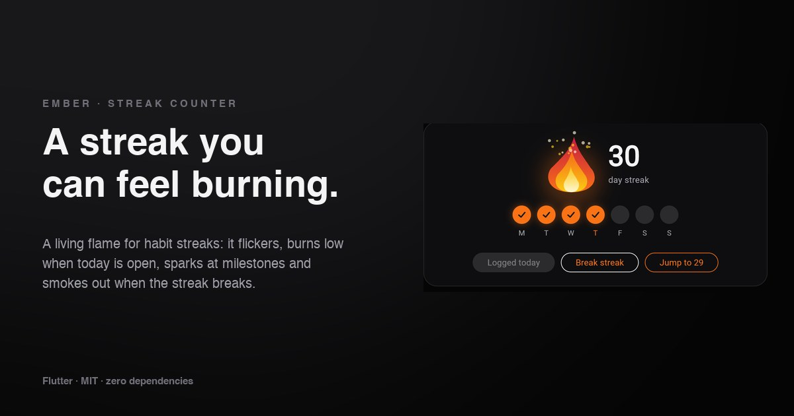

# Ember

A streak counter for Flutter with a **living flame**. It flickers while the
streak is alive, **burns low** when today isn't logged yet, **flares** and
pops the number when you log, throws **sparks** at milestones and
**smokes out** when the streak breaks.

**[→ Live demo](https://yagnikbarasiya23.github.io/ember_streak/)** (the example app, built for the web)



No dependencies beyond Flutter itself. The flame is drawn in code, so there
are no images, Lottie files or fonts to ship.

## Why

A streak is only motivating if it feels like something you could lose.
A static number doesn't. Ember turns the count into a small fire that
visibly dims when today is still open and goes out when it's missed, so the
state is obvious at a glance.

## Install

```yaml
dependencies:
  ember_streak:
    git:
      url: https://github.com/YagnikBarasiya23/ember_streak.git
```

Requires Flutter 3.47 or newer.

## Use it

```dart
import 'package:ember_streak/ember_streak.dart';

EmberStreak(
  count: 12,
  week: const [true, true, true, false, false, false, false],
  today: 3,                 // index in week that gets a ring
  doneToday: false,         // false with count > 0 = at risk
  onMilestone: (days) => showConfetti(days),
)
```

Change `count`, `week` and `doneToday` as the user logs; Ember animates the
difference:

| Change | What you see |
| --- | --- |
| `doneToday` false → true, `count` up | Flame grows and flares, the number pops, today's day fills |
| `count` reaches a milestone | Sparks fly up and `onMilestone` is called once |
| `count` > 0, `doneToday` false | Low, pulsing flame and an “at risk” hint |
| `count` → 0 | Flame shrinks, smoke curls up, an outline and wick stay |

### Properties

| Property | Default | |
| --- | --- | --- |
| `count` | required | Current streak length |
| `week` | `[]` | Done days in `dayLabels` order; empty hides the row |
| `today` | `null` | Index of today in `week` |
| `doneToday` | `true` | Whether today counts yet |
| `flameSize` | `96` | Width and height of the flame |
| `milestones` | `3, 7, 14, 30, 50, 100, 365` | Counts that set off sparks |
| `dayLabels` | `M T W T F S S` | Labels under the days |
| `unit` | `'day streak'` | Text under the number, also read by screen readers |
| `numberStyle`, `unitStyle` | 44 px bold / 14 px | Text styles |
| `flameColors` | red → orange → yellow → cream | Four colours, outer to inner |
| `dayColor`, `emptyDayColor` | orange / faint white | Day circles |
| `atRiskHint` | `'Log today to keep it'` | `null` hides it |
| `onMilestone` | `null` | Called with the milestone reached |

## How it works

- **`flamePath()`** builds a teardrop from four cubic curves. The tip sways
  and the belly breathes on a few summed sine waves, so it never loops
  visibly. Three layers with their own seed and colours stack into one flame.
- **One ticker** feeds the time to the painter, and only runs while there is
  a flame (or smoke). A streak that's out costs nothing per frame.
- **Small controllers** handle the rest: heat (the flame's size, with an
  overshoot when it grows), the flare, the number pop, sparks and smoke.
- **`emberStatusFor()`** and **`milestoneCrossed()`** are plain functions,
  so the rules are easy to test and to reuse in your own logic. A jump past
  several milestones reports the highest one, and going down never fires.

## Accessibility

- The whole widget is one live region with a single label, such as
  “12 day streak, 3 of 7 days this week. Log today to keep it”, so a screen
  reader announces changes without reading every day circle.
- With *reduce motion* enabled, the flame is drawn still, and the number,
  days and heat change without animating. Milestone callbacks still fire.

## Example app

```bash
cd example
flutter run            # any device
flutter run -d chrome  # the web demo
```

Log today, break the streak, jump to 29 and log to hit the 30-day milestone,
plus a row of smaller streaks with their own colours.

## Tests

```bash
flutter test
```

Covers status and milestone rules, flame bounds, the semantics label, the
number pop and single milestone callback, the ticker stopping after the
flame goes out, reduced motion, and painting every state.

## Licence

[MIT](LICENSE) © 2026 Yagnik Barasiya. Use it in personal and client work.

More components at [yagnikbarasiya.com/components](https://www.yagnikbarasiya.com/components).
